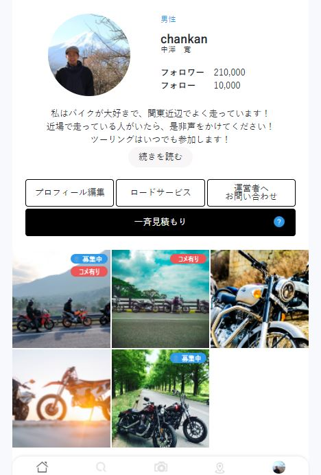
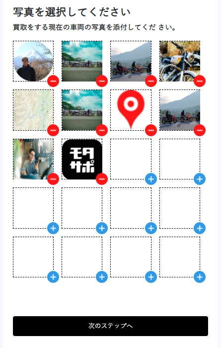
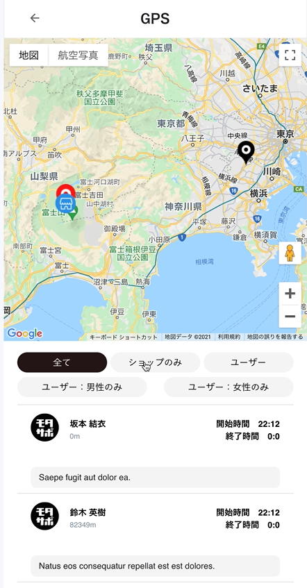
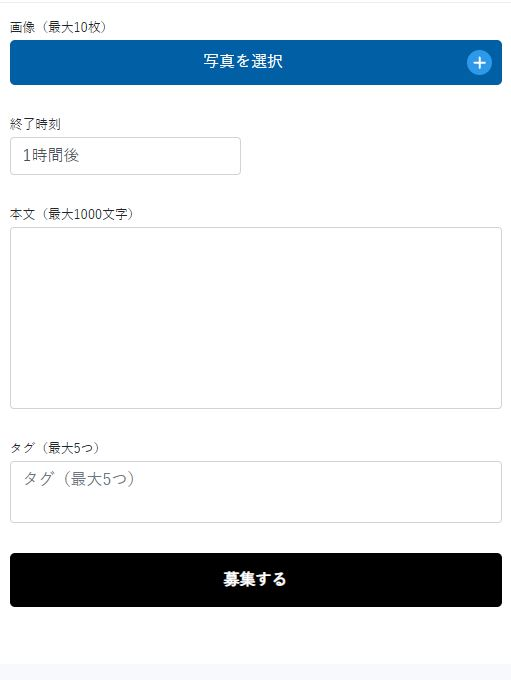
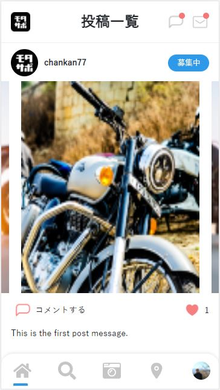

# Matching Site by using GPS and Message

<h3>このプロジェクトは、Googleマップとランタイムメッセージを使用してサイトを照合しています。(This project is matching site by using Google Map and run-time message.)</h3> 
<h4><b>Language</b>: Laravel & React & Typescript</h4>

<ul>
    <li>[gps_home.jpg]
        <dl>
            このページは、ログインしてサインアップするための最初のページです。(This page is first page to login and signup.)
        </dl>
    </li>
    <li>[gps_intro.jpg]
        <dl>
            このページはあなたの紹介を示しています。(This page shows your introduction.)
        </dl>
    </li>
    <li>[gps_img_upload.jpg]
        <dl>
            このページは、画像とメッセージを自分のパートナーに送信するための画像アップロードページです。(This page is image upload page to send image and message to own partner.)
        </dl>
    </li>
    <li>[gps_map.jpg]
        <dl>
            このページは、彼らの場所から最短距離にあるパートナーやショップの位置を示しています。(This page shows the position of partners and shops where there are in the shortest way from their place.)
        </dl>
    </li>
    <li>[gps_matching.jpg]
        <dl>
            このページには、パートナーやショップの情報が表示されます。(This page shows the information of partners and shops.)
        </dl>
    </li>
    <li>[gps_message.jpg]
         <dl>
            このページから、実行時にパートナーにメッセージを送信できます。(Through this page, you can send message to your partner in run-time)
        </dl>
    </li>
    <li>[gps_profile.jpg]
        <dl>
            このページを通して、あなたは指定された人のプロフィールを見ることができます。(Through this page, you can see the profile of specified person.)
        </dl>
    </li>
    <li>...</li>
</ul>
<h3>[gps_home.jpg]</h3>

<h3>[gps_intro.jpg]</h3>

<h4>[gps_img_upload.jpg]</h4>

<h4>[gps_map.jpg]</h4>

<h4>[gps_message.jpg]</h4>

<h4>[gps_profile.jpg]</h4>

<h3>Install </h3>
<ul>
    <li>１．Docker立ち上げ</li>
    <dl>docker-compose up -d</dl>
    <li>２．appに入る</li>
    <dl>docker-compose exec app bash</dl>
    <li>３．各種インストール</li>
    <dl>
        npm install 
        composer install
    </dl>
    <li>４．npm実行</li>
    <dl>
        php artisan key:generate 
        npm run watch(npm run dev)
    </dl>
    <li>５．DB接続</li>
    <dl>
        cp .env.example .env 
        php artisan migrate:fresh --seed
    </dl>
</ul>

&copy; 2021 All rights reserved.

