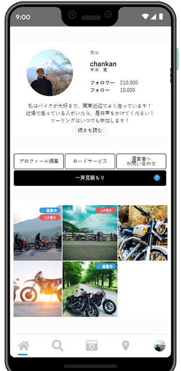

# バイク・車好きのためのウェブアプリ｜モタサポ
### (Web app for motorcycle and car lovers ｜ Motasapo)
 

<h3>このシステムは、自転車、自動車、お客様の評価に基づいて、顧客の購買に信頼性を確保するシステムです。
製品お客様の評価と顧客との間のメッセージ機能は、GPSを介して最も近い店と顧客を知っている彼らとメッセージを与え、製品の信頼性を確保してくれます。(This system is a system that secures reliability through customer purchases based on customer evaluations of bicycles and automobiles.
Product customer testimonials and message between customers function know the nearest store and customer via GPS and message with them, thus gaining trust in the product.)</h3> 
<h4><b>Language</b>: Laravel & React & Typescript & MySQL</h4>

<!-- <ul>
    <li>[motasapo_home.png]
        <dl>
            このページは、ログインしてサインアップするための最初のページです。(This page is first page to login and signup.)
        </dl>
    </li>
    <li>[motasapo_intro.png]
        <dl>
            このページはあなたの紹介を示しています。(This page shows your introduction.)
        </dl>
    </li>
    <li>[motasapo_image_upload.png]
        <dl>
            このページは、画像とメッセージを自分のパートナーに送信するための画像アップロードページです。(This page is image upload page to send image and message to own partner.)
        </dl>
    </li>
    <li>[motasapo_map.png]
        <dl>
            このページは、彼らの場所から最短距離にあるパートナーやショップの位置を示しています。(This page shows the position of partners and shops where there are in the shortest way from their place.)
        </dl>
    </li>
    <li>[motasapo_matching.png]
        <dl>
            このページには、パートナーやショップの情報が表示されます。(This page shows the information of partners and shops.)
        </dl>
    </li>
    <li>[motasapo_message.png]
         <dl>
            このページから、実行時にパートナーにメッセージを送信できます。(Through this page, you can send message to your partner in run-time)
        </dl>
    </li>
    <li>[motasapo_profile.png]
        <dl>
            このページを通して、あなたは指定された人のプロフィールを見ることができます。(Through this page, you can see the profile of specified person.)
        </dl>
    </li>
    <li>...</li>
</ul> -->
<h3>[motasapo_home.png]</h3>

<h3>[motasapo_login.png]</h3>

<h4>[motasapo_post.png]</h4>

<h4>[motasapo_message.png]</h4>

<h4>[motasapo_map.png]</h4>

<h4>[motasapo_detail.png]</h4>

<h4>[motasapo_map_detail.png]</h4>

<h4>[motasapo_profile.png]</h4>

<h4>[motasapo_image_upload.png]</h4>

<h3>Install </h3>
<ul>
    <li>１．Docker立ち上げ</li>
    <dl>docker-compose up -d</dl>
    <li>２．appに入る</li>
    <dl>docker-compose exec app bash</dl>
    <li>３．各種インストール</li>
    <dl>
        npm install 
        composer install
    </dl>
    <li>４．npm実行</li>
    <dl>
        php artisan key:generate 
        npm run watch(npm run dev)
    </dl>
    <li>５．DB接続</li>
    <dl>
        cp .env.example .env 
        php artisan migrate:fresh --seed
    </dl>
</ul>

&copy; 2021 All rights reserved.

